# 🎯 Interview Scheduling System - Complete Implementation

## Status: ✅ Backend Complete | ⏳ Frontend Ready for Integration

---

## 📋 What's Inside

This implementation adds a complete interview scheduling workflow to your AI recruitment platform:

### ✨ Features Implemented

1. **Recruiter sends interview invites** with multiple time slot options
2. **Candidates receive notifications** with invite details in metadata
3. **Candidates select preferred time slots** through existing scheduling UI
4. **Recruiters view all candidate responses** in a dedicated dashboard section
5. **Automatic notifications** for both parties throughout the flow
6. **Full audit trail** with timestamps and status tracking
7. **Security via RLS policies** - users only see their own data

---

## 🚀 Quick Start

### For Backend Development
```bash
# 1. Run database migration
# Go to Supabase SQL Editor → Paste: backend/migrations/add_notifications_and_invites.sql

# 2. Start backend
cd backend
python -m uvicorn app.main:app --reload

# 3. Check endpoints
# Navigate to: http://localhost:8000/docs
```

### For Frontend Development
See **FRONTEND_INTEGRATION_GUIDE.md** for:
- How to fetch notifications
- How to open scheduling modal from notification
- How to submit candidate response
- How to display recruiter responses

---

## 📁 Project Structure

```
project-root/
├── 📄 IMPLEMENTATION_SUMMARY.md        ← Status overview
├── 📄 API_SCHEDULING_CONTRACT.md       ← Complete API documentation
├── 📄 FRONTEND_INTEGRATION_GUIDE.md    ← Step-by-step frontend guide
├── 📄 QUICKSTART.sh / QUICKSTART.ps1   ← Interactive setup guide
│
├── backend/
│   ├── app/
│   │   ├── api/endpoints/
│   │   │   ├── notifications.py        ← NEW: All scheduling endpoints
│   │   │   ├── schedule.py             ← ENHANCED: Added logging
│   │   │   └── ...
│   │   ├── schemas/
│   │   │   └── schemas.py              ← UPDATED: New Pydantic models
│   │   └── main.py                     ← UPDATED: Registered router
│   │
│   ├── migrations/
│   │   └── add_notifications_and_invites.sql  ← NEW: DB migration
│   └── ...
│
├── supabase_schema.sql                 ← UPDATED: New tables
└── frontend/
    ├── src/app/
    │   ├── candidate/dashboard/        ← TO INTEGRATE: Fetch notifications
    │   ├── schedule/[applicationId]/   ← TO INTEGRATE: Handle invite response
    │   └── recruiter/dashboard/        ← TO INTEGRATE: Show responses
    └── ...
```

---

## 🔗 API Endpoints Reference

### Candidate Flow
```
POST   /api/v1/invites                      Create invite (Recruiter)
GET    /api/v1/invites/{invite_id}          Get time slots
POST   /api/v1/invites/{invite_id}/respond  Submit selection
GET    /api/v1/notifications                Get notifications
POST   /api/v1/notifications/{id}/read      Mark as read
```

### Recruiter Flow
```
GET    /api/v1/recruiter/responses          View candidate responses
```

**Full documentation:** See `API_SCHEDULING_CONTRACT.md`

---

## 💾 Database Changes

### New Tables

#### `interview_invites`
- Stores recruiter's proposed time slots
- Tracks candidate's selected time slot
- Manages status (pending → accepted/rejected)

#### `notifications`
- In-app notifications for candidates and recruiters
- Stores invite_id in metadata (critical for UI)
- Tracks read/unread status

**Migration script:** `backend/migrations/add_notifications_and_invites.sql`

---

## 🔐 Security Features

✅ **Row-Level Security (RLS) Policies**
- Recruiters only see their own invites
- Candidates only see invites for their applications
- Users only read their own notifications

✅ **Data Validation**
- Pydantic models validate all input
- Time slots verified before acceptance
- Database constraints prevent conflicts

✅ **Audit Trail**
- All timestamps recorded (UTC ISO 8601)
- Status transitions tracked
- Created/updated fields maintained

---

## 📖 Documentation Files

### 1. **IMPLEMENTATION_SUMMARY.md**
- Overview of implementation
- Files changed/created
- End-to-end flow diagram
- Next steps

### 2. **API_SCHEDULING_CONTRACT.md**
- Complete API specification
- Request/response examples
- Error handling guide
- curl test commands
- Frontend integration examples

### 3. **FRONTEND_INTEGRATION_GUIDE.md**
- Step-by-step integration instructions
- Code examples for each step
- Reusable hook examples
- Testing instructions
- UI/UX tips

### 4. **QUICKSTART.sh / QUICKSTART.ps1**
- Interactive setup guide
- Step-by-step walkthrough
- Verification steps

---

## 🎯 Integration Workflow

```mermaid
graph LR
    A["Recruiter<br/>Sends Invite"] -->|POST /invites| B["Backend:<br/>Create invite<br/>& notification"]
    B -->|✅| C["Candidate<br/>Sees Notification"]
    C -->|Click invite<br/>Extract invite_id| D["Frontend:<br/>GET /invites"]
    D -->|Get time slots| E["Scheduling<br/>Modal Opens"]
    E -->|Select slot| F["Frontend:<br/>POST /respond"]
    F -->|✅| G["Backend:<br/>Update status<br/>Notify recruiter"]
    G -->|✅| H["Recruiter<br/>Dashboard:<br/>GET /responses"]
    H -->|Display| I["'Candidate<br/>Accepted<br/>March 28'"]
```



---

## 🧪 Testing Checklist

### Backend Setup
- [ ] Run database migration in Supabase
- [ ] Verify `interview_invites` table exists
- [ ] Verify `notifications` table exists
- [ ] Start backend server
- [ ] Check http://localhost:8000/docs for endpoints
- [ ] See 6 new endpoints in Swagger UI

### API Testing
- [ ] Test `POST /invites` - creates invite
- [ ] Test `GET /invites/{id}` - returns slots
- [ ] Test `GET /notifications` - returns notifications
- [ ] Test `POST /respond` - updates invite
- [ ] Test `GET /recruiter/responses` - returns responses

### Logging Verification
- [ ] See `✅ Created interview_invites record` in logs
- [ ] See `✅ Created INTERVIEW_INVITE notification` in logs
- [ ] See `✅ Updated interview_invites` in logs

### Frontend Integration
- [ ] Candidate dashboard fetches notifications
- [ ] Click notification extracts invite_id
- [ ] Scheduling modal receives invite_id
- [ ] Modal shows time slots from backend
- [ ] Submit button calls POST /respond
- [ ] Success message shows after submit
- [ ] Recruiter dashboard shows responses

---

## 🐛 Troubleshooting

### Issue: Notification has no `invite_id`
**Check:**
- Was `interview_invites` record created? (check DB)
- Did `POST /invites` return 200?
- Is metadata being set? (check logs)

### Issue: Scheduling modal won't open
**Check:**
- Is `GET /invites/{invite_id}` returning 200?
- Are `proposed_time_slots` in response?
- Is frontend extracting `invite_id` correctly?

### Issue: Candidate response not saved
**Check:**
- Did `POST /respond` return 200?
- Is `interview_invites` status "accepted"?
- Is `selected_time_slot` set in DB?

### Issue: Recruiter doesn't see responses
**Check:**
- Is `GET /recruiter/responses` returning data?
- Are responses for recruiter's own applications?
- Is auth token valid and recruiter role correct?

---

## 📊 Logging Output Examples

```
🔄 Recruiter recruiter@company.com sending invite for application app-123
✅ Created interview_invites record inv-456 with 4 slots
✅ Created INTERVIEW_INVITE notification for john@example.com
✅ Sent invite email to john@example.com

🔍 Fetching invite details for inv-456
✅ Found invite inv-456 with status=pending, 4 slots

🔍 Fetching notifications for user candidate@example.com
✅ Found 2 notifications for candidate@example.com

🔄 Candidate candidate@example.com responding to invite inv-456 with slot 2026-03-28T14:00:00Z
✅ Updated interview_invites inv-456: status=accepted, selected_time_slot=2026-03-28T14:00:00Z
✅ Created RESPONSE notification for recruiter

🔍 Fetching candidate responses for recruiter recruiter@company.com
✅ Found 2 candidate responses for recruiter@company.com
```

---

## 🚀 Next Steps

### Phase 1: Backend ✅
- [x] Create database tables
- [x] Add RLS policies
- [x] Implement API endpoints
- [x] Add comprehensive logging
- [x] Create API documentation

### Phase 2: Frontend ⏳
- [ ] Update candidate dashboard to fetch notifications
- [ ] Add notification click handler
- [ ] Update scheduling modal for invite workflow
- [ ] Add recruiter responses section
- [ ] Test end-to-end flow

### Phase 3: Polish 🔮
- [ ] Add email confirmations (already in code)
- [ ] Add real-time updates (WebSocket)
- [ ] Add notification preferences UI
- [ ] Performance monitoring
- [ ] Analytics tracking

---

## 📞 Support

### For Questions About...

**API Endpoints**
→ See `API_SCHEDULING_CONTRACT.md`

**Frontend Integration**
→ See `FRONTEND_INTEGRATION_GUIDE.md`

**Database Schema**
→ Check `supabase_schema.sql` or migrations/

**Implementation Details**
→ Read `backend/app/api/endpoints/notifications.py`

---

## ✨ Key Highlights

🎯 **Zero UI Changes** - Uses existing components  
🔐 **Secure by Default** - RLS policies built-in  
📊 **Fully Logged** - Debug-friendly with emoji indicators  
📱 **Mobile Ready** - Works with any frontend framework  
🚀 **Production Ready** - Error handling and validation included  
📚 **Well Documented** - 3 comprehensive guides included  

---

## 🎓 Learning Resources

The implementation demonstrates:
- ✅ FastAPI router patterns
- ✅ Pydantic model validation
- ✅ Supabase RLS policies
- ✅ Async/await patterns
- ✅ Error handling best practices
- ✅ Logging patterns
- ✅ Database transaction safety
- ✅ API contract documentation

---

## 📝 License & Credits

Built as part of AI Interviewer Skill Assessment Platform  
Created: March 2026  
Implemented: Interview Scheduling System  

---

## 🎉 You're All Set!

**Status:** Backend ready for frontend integration

**Next Action:** Read `FRONTEND_INTEGRATION_GUIDE.md` and start wiring up frontend calls

**Questions?** Check the relevant documentation file listed above

---

### Quick Links
- 🚀 [Quick Start Guide](./QUICKSTART.ps1)
- 📖 [API Contract](./API_SCHEDULING_CONTRACT.md)
- 🎯 [Frontend Integration](./FRONTEND_INTEGRATION_GUIDE.md)
- 📊 [Implementation Summary](./IMPLEMENTATION_SUMMARY.md)
